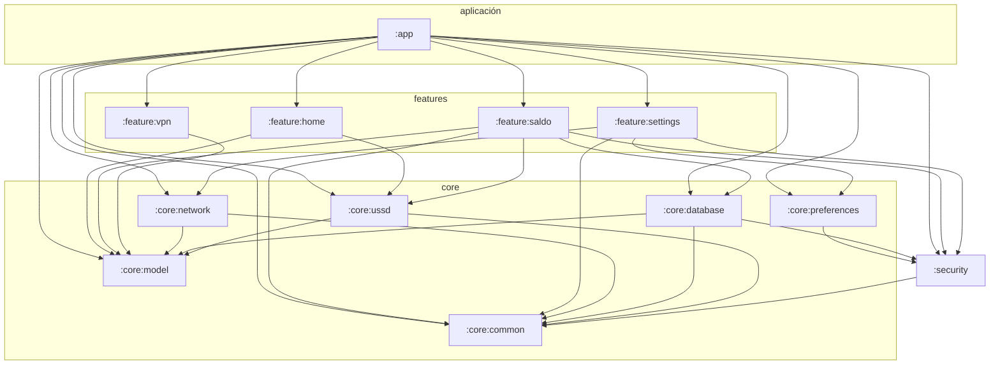

# ARCHITECTURE.md — Grafo de módulos y responsabilidades

## Origen

La app original ya tenía una organización interna reconocible en los paquetes
(`core`, `data`, `feature/*`, `sync`, `widget`, `messaging`). La fragmentación
de este repo la formaliza en **módulos Gradle independientes**, cada uno
compilable y testeable por separado, con fronteras explícitas.

## Grafo de dependencias

(Equivalente textual en `settings.gradle.kts`.)

## Responsabilidades y justificación de cada módulo

| Módulo | Tipo | Responsabilidad | ¿Por qué es un módulo aparte? |
|---|---|---|---|
| `:core:model` | Kotlin/JVM | Data classes compartidas (`UssdCode`, `BalanceSnapshot`, `NautaAccountModel`, `UpdateManifest`) | Cero dependencias: la asamblea común que rompe ciclos |
| `:core:common` | Kotlin/JVM | Validadores puros (`UssdCodeValidator`, `PhoneNumberValidator`, `VersionNameComparator`) | Lógica 100 % testeable sin Android; la reutilizan red, ussd y features |
| `:core:network` | Kotlin/JVM | Cliente HTTPS endurecido: política TLS (`TlsPolicy`), canal de actualizaciones (`UpdateCheckClient`), verificador de integridad (`ApkIntegrityVerifier`) | El punto único de red: auditar "todo el tráfico" = auditar un módulo |
| `:security` | Android | `CryptoEngine` (AES-GCM), `AndroidKeystoreKeyProvider`, `PasswordHasher` (PBKDF2), `SafeLogger` (redacción de PII), `FileIntegrity` | Aísla toda la criptografía; cualquier cambio se audita y testea en un solo sitio |
| `:core:preferences` | Android | DataStore con valores sensibles cifrados en campo (`UserPreferencesDataSource`) | Depende de `:security` pero no del resto; sustituye al DataStore en claro del original |
| `:core:database` | Android | SQLite (`UtilTecsDatabase`): `nauta_accounts` (password cifrada), `ussd_responses` | Persistencia aislada; compatible en esquema con el original (`JetpackDatabase`) |
| `:core:ussd` | Android | `UssdExecutor` (`sendUssdRequest` + validación) y `UssdCatalog` cerrado | Único punto que "toca el teléfono": sin él no se marcan códigos |
| `:feature:home` | Android/Compose | Pantalla principal y navegación entre herramientas | Funcionalidad independiente, compilable y preview-able sola |
| `:feature:saldo` | Android/Compose | Consulta USSD con confirmación explícita (`SaldoScreen`, `SaldoViewModel`) | Aísla la función crítica marcada por los hallazgos M-1 del informe |
| `:feature:settings` | Android/Compose | Ajustes, tema, comprobación de actualizaciones verificadas | Une `:core:network` y `:core:preferences` sin exponerlos entre sí |
| `:feature:vpn` | Android/Compose | Estado y plan de integración del backend WireGuard | Mantiene visible la funcionalidad pendiente sin arrastrar librerías nativas |
| `:app` | Android | Composición final: DI manual (`UtilEsApp`), `MainActivity` + NavHost, **manifest endurecido**, recursos de seguridad | Único módulo que ensambla; no contiene lógica de negocio |

### Reglas de dependencia (enforcement manual, verificable en el grafo)

1. **Ninguna feature depende de otra feature.** La comunicación pasa por `:app`
   (navegación) o `:core:model` (tipos compartidos).
2. **`:security` no depende de features ni de red/persistencia.** Es hoja de
   criptografía; solo conoce `:core:common`.
3. **`:core:network` no conoce la app ni la UI.** Solo tipos de `:core:model`.
4. **`:core:ussd` es el único módulo con APIs de telefonía.** Los features piden,
   nunca marcan directamente.
5. **`:app` no contiene reglas de negocio**: ensambla y expone el manifest
   endurecido.

## Correspondencia con el código decompilado

| Paquete original (`cu.lestebang.utiletecsa.*`) | Módulo en este repo |
|---|---|
| `core.network`, `data.repository.*` (DTOs) | `:core:model` + `:core:network` |
| `core.preferences.model.*` | `:core:preferences` |
| `core.room.data.JetpackDatabase` (+ entidades R8 en `defpackage`: `fr4` nauta, `oz7` ussd_responses) | `:core:database` |
| Lógica USSD (`shortcuts.UssdShortcutActivity`, enum R8 `az7`, servicios `UssdAuto*`) | `:core:ussd` |
| `sync.worker.AppUpdateWorker`, `sync.DownloadApkReceiver` | `:core:network` (`UpdateCheckClient`, `ApkIntegrityVerifier`) + `:app` (`UpdateManager`) |
| `feature.home`, `feature.nauta`, `feature.planes`, … | `:feature:home` (resto: pendiente, ver abajo) |
| `messaging.UtilEsMessagingService` | No re-implementado (requiere Firebase; ver pendientes) |
| `widget.*` | No re-implementado |
| Cifrado Nauta (clase R8 `su0`, clave `nauta_account_key`) | `:security` (`CryptoEngine` + `AndroidKeystoreKeyProvider`) |

## Stack y decisiones técnicas

- **Gradle 8.14.3 / AGP 8.13.0 / Kotlin 2.2.20** — líneas estables al momento de
  la auditoría (sept 2026). Se elige la rama AGP 8.x en lugar de la 9.x (que
  impone "built-in Kotlin" y Gradle 9.6) para minimizar riesgo en una base de
  reconstrucción; la migración a AGP 9 está documentada como trabajo futuro.
- **Compose** para toda la UI (el original ya era Compose/Material3).
- **Sin Hilt / sin Room / sin Retrofit** en esta fase: DI manual, SQLite directo
  con cifrado a nivel de columna, y OkHttp puro. Razón: minimizar generadores de
  código y dependencias mientras la base no es estable; migración documentada.
- **R8** activado en release (`minifyEnabled` + `shrinkResources`) con reglas
  mínimas (corrige I-1 del informe).
- **Código muerto eliminado**: no se portaron los permisos y componentes sin uso
  del original (`PROCESS_OUTGOING_CALLS`, widgets sin backend, `USE_FINGERPRINT`
  deprecado, overlays, `profileable`, etc.).

## Trabajo pendiente (roadmap)

1. **`:feature:nauta`** — cliente de correo Nauta completo (IMAP/SMTP) con las
   contraseñas del almacén cifrado.
2. **`:feature:vpn` real** — integrar el artefacto oficial
   `com.wireguard.android:tunnel` (Maven Central) en lugar del binario
   `libwg-go.so` original, declarando `GoBackend` con `BIND_VPN_SERVICE`.
3. **`:core:sync`** — WorkManager con política de batería correcta (sustituye a
   `UssdAutoUpdaterService`/`BalanceNotificationService` sin
   `REQUEST_IGNORE_BATTERY_OPTIMIZATIONS`).
4. **Migración a Room + KSP** y a AGP 9.x cuando la base sea estable.
5. **App Check / Play Integrity** si se reintroduce backend Firebase
   (mitigación de B-3).
